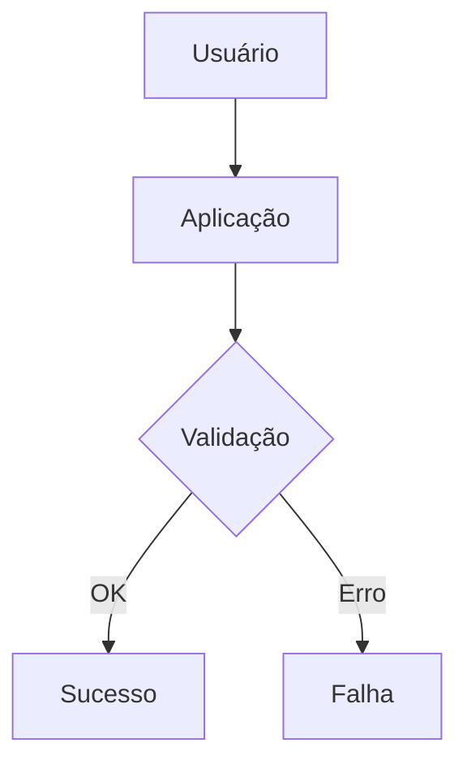
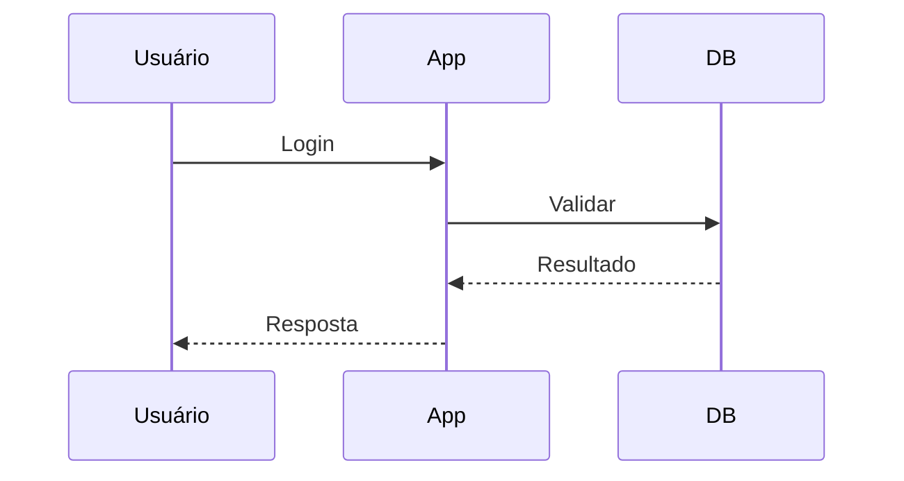

# 🚀 SoundLink Markdown PDF Generator


**Gerador profissional de PDFs a partir de Markdown** com suporte completo para **emojis** e **diagramas Mermaid**! 📄✨

## 🎯 Características

- 🎨 **Diagramas Mermaid**: Flowcharts, diagramas de sequência, Gantt, etc.
- 😊 **Emojis Nativos**: Suporte completo para emojis Unicode e :shortcodes:
- 📊 **Tabelas Profissionais**: Formatação moderna e responsiva
- 💻 **Syntax Highlighting**: Código com destaque de sintaxe
- 🎨 **Estilos Customizáveis**: CSS profissional com tema SoundLink
- 📱 **Responsivo**: Design que funciona em todos os tamanhos
- 🔄 **Processamento Assíncrono**: Performance otimizada
- 🧹 **Auto-limpeza**: Arquivos temporários são automaticamente removidos

## 🛠️ Instalação

### Pré-requisitos
- Python 3.8+
- Node.js (para Playwright)

### Instalação Simples
```bash
cd /home/jesus/Projetos/markdown-pdf-generator
pip install -r requirements.txt
playwright install chromium
```

### Instalação para Desenvolvimento
```bash
# Instalar em modo desenvolvimento
pip install -e .

# Instalar dependências de desenvolvimento
pip install -r requirements-dev.txt
```

## 🚀 Uso

### CLI Interface

```bash
# Uso básico
python3 src/main.py documento.md

# Especificar arquivo de saída
python3 src/main.py documento.md -o relatorio.pdf

# Gerar apenas HTML
python3 src/main.py documento.md --html

# Formato personalizado
python3 src/main.py documento.md --format A3 --landscape

# CSS customizado
python3 src/main.py documento.md --css custom.css

# Margens personalizadas
python3 src/main.py documento.md --margin "20,15,20,15"

# Logs detalhados
python3 src/main.py documento.md --verbose
```

### Uso Programático

```python
from src.main import generate_pdf
import asyncio

async def main():
    success = await generate_pdf(
        input_file="documento.md",
        output_file="documento.pdf",
        args=args  # argparse args
    )
    
    if success:
        print("✅ PDF gerado com sucesso!")
    else:
        print("❌ Erro na geração do PDF")

# Executar
asyncio.run(main())
```

## 📋 Recursos Suportados

### Markdown Padrão
- [x] **Headers** (H1-H6)
- [x] **Parágrafos** com justificação
- [x] **Listas** ordenadas e não ordenadas
- [x] **Links** com formatação
- [x] **Imagens** com responsividade
- [x] **Tabelas** com estilo profissional
- [x] **Código** inline e blocos
- [x] **Blockquotes** estilizados
- [x] **Linha horizontal**
- [x] **Formatação** (negrito, itálico, tachado)

### Extensões Avançadas
- [x] **Emojis** Unicode e :shortcodes:
- [x] **Mermaid** (todos os tipos de diagramas)
- [x] **Tabelas** com formatação avançada
- [x] **Syntax highlighting** para código
- [x] **TOC** (Table of Contents) automático
- [x] **Metadata** YAML front matter
- [x] **Task lists** (checkboxes)
- [x] **Footnotes** e referências

### Tipos de Diagramas Mermaid
- 📊 **Flowcharts** (`graph`, `flowchart`)
- 🔄 **Sequence Diagrams** (`sequenceDiagram`)
- 📋 **Class Diagrams** (`classDiagram`)
- 🎯 **State Diagrams** (`stateDiagram`)
- 📅 **Gantt Charts** (`gantt`)
- 🥧 **Pie Charts** (`pie`)
- 🗺️ **User Journey** (`journey`)
- 🌲 **Git Graphs** (`gitgraph`)
- 🧠 **Mind Maps** (`mindmap`)
- ⏰ **Timeline** (`timeline`)
- 📈 **ER Diagrams** (`erDiagram`)
- 🏗️ **C4 Context** (`c4Context`)

## 🎨 Exemplos

### Documento com Emojis
```markdown
# 🚀 Título Principal

Este documento contém **emojis** nativos! 😊

## 📊 Seção com Dados
- 📈 Gráficos
- 📉 Relatórios
- 📋 Listas

🎉 **Sucesso!** Emojis funcionando perfeitamente!
```

### Documento com Mermaid
```markdown
# Fluxo do Sistema



### Sequência de Login

```

### Metadata YAML
```markdown
---
title: "Relatório Mensal"
subtitle: "Análise de Performance"
author: "SoundLink Team"
date: "2024-01-15"
description: "Relatório detalhado de performance do sistema"
---

# Conteúdo do documento...
```

## ⚙️ Configuração

### Formatos Suportados
- **A4** (padrão), A3, A2, A1, A0
- **Letter**, Legal, Tabloid

### Opções de Margem
```bash
# Formato: "top,right,bottom,left" em mm
--margin "20,15,20,15"  # Padrão
--margin "30,20,30,20"  # Margens maiores
--margin "10,10,10,10"  # Margens menores
```

### CSS Customizado
```css
/* custom.css */
.document-title {
    color: #e74c3c;
    font-size: 3rem;
}

.document-content {
    font-family: 'Georgia', serif;
}

.mermaid {
    background: #f0f0f0;
    border: 2px solid #333;
}
```

## 🧪 Testes

### Executar Testes
```bash
# Todos os testes
python -m pytest tests/

# Testes específicos
python -m pytest tests/test_parser.py

# Com coverage
python -m pytest tests/ --cov=src/
```

### Testar com Arquivo de Exemplo
```bash
# Gerar PDF do arquivo de exemplo
python3 src/main.py tests/fixtures/sample.md -o exemplo.pdf

# Gerar HTML do arquivo de exemplo
python3 src/main.py tests/fixtures/sample.md --html
```

## 🔧 Desenvolvimento

### Estrutura do Projeto
```
markdown-pdf-generator/
├── src/
│   ├── __init__.py
│   ├── main.py                 # CLI interface
│   ├── parser/
│   │   ├── __init__.py
│   │   ├── markdown_parser.py  # Parser de Markdown
│   │   └── mermaid_processor.py # Processador Mermaid
│   ├── generator/
│   │   ├── __init__.py
│   │   ├── html_generator.py   # Gerador HTML
│   │   └── pdf_generator.py    # Gerador PDF
│   └── templates/
│       ├── base.html           # Template HTML
│       └── styles.css          # Estilos CSS
├── tests/
│   ├── __init__.py
│   ├── test_parser.py
│   ├── test_generator.py
│   └── fixtures/
│       └── sample.md           # Arquivo de teste
├── requirements.txt
├── setup.py
└── README.md
```

### Contribuindo
1. Fork o projeto
2. Crie uma branch para sua feature
3. Faça commit das mudanças
4. Push para a branch
5. Abra um Pull Request

## 🐛 Troubleshooting

### Problema: Playwright não instalado
```bash
# Solução
playwright install chromium
```

### Problema: Dependências não encontradas
```bash
# Solução
pip install -r requirements.txt
```

### Problema: Mermaid não renderiza
```bash
# Verificar se o arquivo contém sintaxe Mermaid válida
python3 src/main.py documento.md --verbose
```

### Problema: Emojis não aparecem
- Verificar se o sistema tem fonts de emoji instaladas
- Usar emojis Unicode ou :shortcodes:

## 📈 Performance

### Benchmarks
- **Documento simples** (10 páginas): ~2-3 segundos
- **Com Mermaid** (5 diagramas): ~5-8 segundos
- **Documento complexo** (50 páginas): ~10-15 segundos

### Otimizações
- Processamento assíncrono de diagramas
- Cache de templates
- Reutilização de instâncias do navegador
- Limpeza automática de arquivos temporários

## 🛡️ Segurança

- ✅ **Sanitização** de entrada
- ✅ **Validação** de arquivos
- ✅ **Limpeza** automática de temporários
- ✅ **Timeouts** configurados
- ✅ **Logs** de auditoria

## 📄 Licença

Este projeto está licenciado sob a **MIT License** - veja o arquivo [LICENSE](LICENSE) para detalhes.

## 🤝 Suporte

- 📧 **Email**: dev@soundlink.com.br
- 📂 **Issues**: [GitHub Issues](https://github.com/soundlink/markdown-pdf-generator/issues)
- 📚 **Docs**: [Documentation](https://docs.soundlink.com.br)

## 🎉 Agradecimentos

- **Playwright** - Engine de renderização
- **Mermaid** - Diagramas incríveis
- **Markdown** - Formatação simples
- **SoundLink Team** - Desenvolvimento

---

**Feito com ❤️ pela equipe SoundLink** 🚀

 