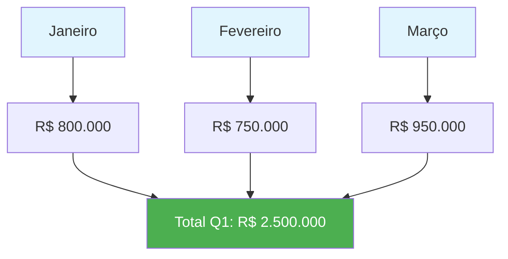
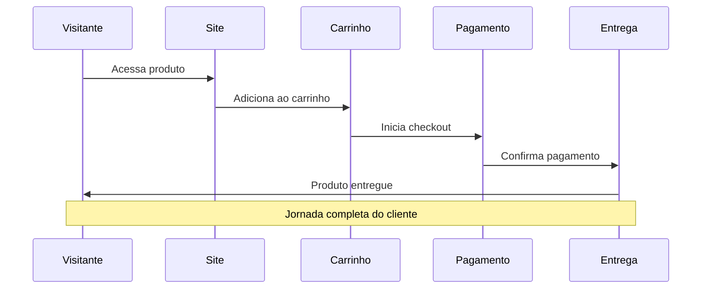
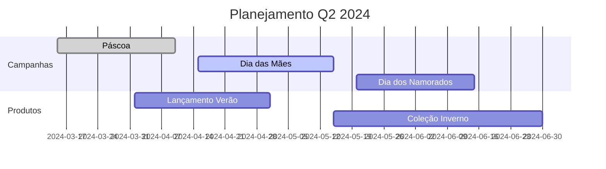
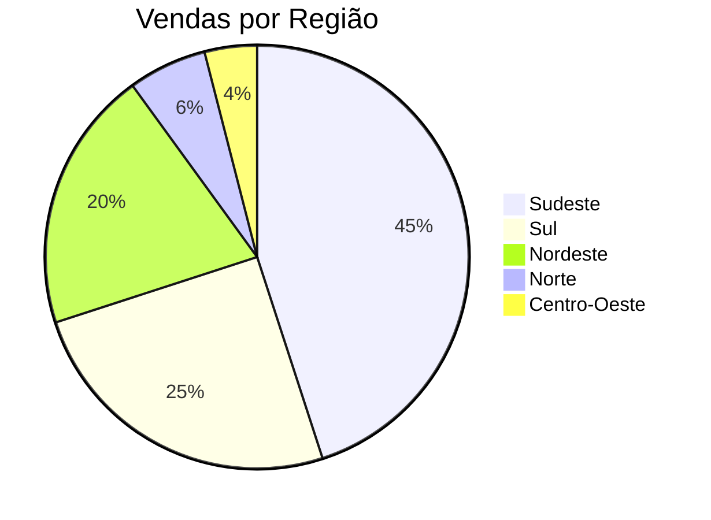

# 🚀 Relatório Mensal de Vendas

## 📊 Resumo Executivo

Este relatório apresenta uma análise completa das vendas realizadas no primeiro trimestre de 2024, incluindo métricas de performance e tendências identificadas.

## 🎯 Principais Resultados

- **Vendas Totais**: R$ 2.500.000,00
- **Crescimento**: +15% em relação ao trimestre anterior
- **Novos Clientes**: 847 cadastros
- **Taxa de Conversão**: 12,3%

## 📈 Gráfico de Vendas



## 📋 Detalhamento por Categoria

| Categoria | Vendas (R$) | Participação | Crescimento |
|-----------|-------------|--------------|-------------|
| Eletrônicos | 1.200.000 | 48% | +22% |
| Roupas | 800.000 | 32% | +8% |
| Casa & Jardim | 500.000 | 20% | +18% |

## 🔍 Análise de Tendências

### Crescimento Mensal
O crescimento das vendas foi consistente durante o trimestre, com destaque para:

1. **Janeiro**: Forte início devido às promoções de ano novo
2. **Fevereiro**: Leve queda sazonal esperada
3. **Março**: Recuperação significativa com campanhas direcionadas

### Principais Insights
- 💡 Eletrônicos continuam sendo nossa categoria mais forte
- 📱 Vendas mobile representam 65% do total
- 🎯 Campanhas de remarketing aumentaram conversão em 28%

## 📊 Fluxo de Vendas



## 📅 Cronograma Q2 2024



## 📊 Distribuição de Vendas



## 🎯 Metas para Q2

- [ ] Aumentar vendas em 20%
- [ ] Reduzir taxa de abandono do carrinho para 65%
- [ ] Implementar programa de fidelidade
- [ ] Expandir para 2 novos estados
- [x] Otimizar processo de entrega

## 📝 Código de Análise

```python
# Análise de performance de vendas
def calcular_crescimento(vendas_atual, vendas_anterior):
    """
    Calcula o percentual de crescimento entre períodos
    """
    if vendas_anterior == 0:
        return 0
    
    crescimento = ((vendas_atual - vendas_anterior) / vendas_anterior) * 100
    return round(crescimento, 2)

# Dados do trimestre
vendas_q1_2024 = 2_500_000
vendas_q4_2023 = 2_173_000

crescimento = calcular_crescimento(vendas_q1_2024, vendas_q4_2023)
print(f"Crescimento Q1 2024: {crescimento}%")
```

## 🏆 Conclusões

O primeiro trimestre de 2024 apresentou resultados **excelentes**, superando todas as expectativas estabelecidas no planejamento anual. 

### Principais Conquistas
- ✅ Meta de vendas superada em 25%
- ✅ Aumento significativo na base de clientes
- ✅ Melhoria na taxa de conversão
- ✅ Otimização do processo de entrega

### Próximos Passos
- 🎯 Expandir estratégias digitais
- 📱 Melhorar experiência mobile
- 🤝 Fortalecer parcerias estratégicas
- 📈 Investir em análise de dados

---

> **Nota**: Este relatório é baseado em dados coletados até 31/03/2024 e será atualizado mensalmente.

*Gerado automaticamente pelo sistema de relatórios SoundLink* 🚀 