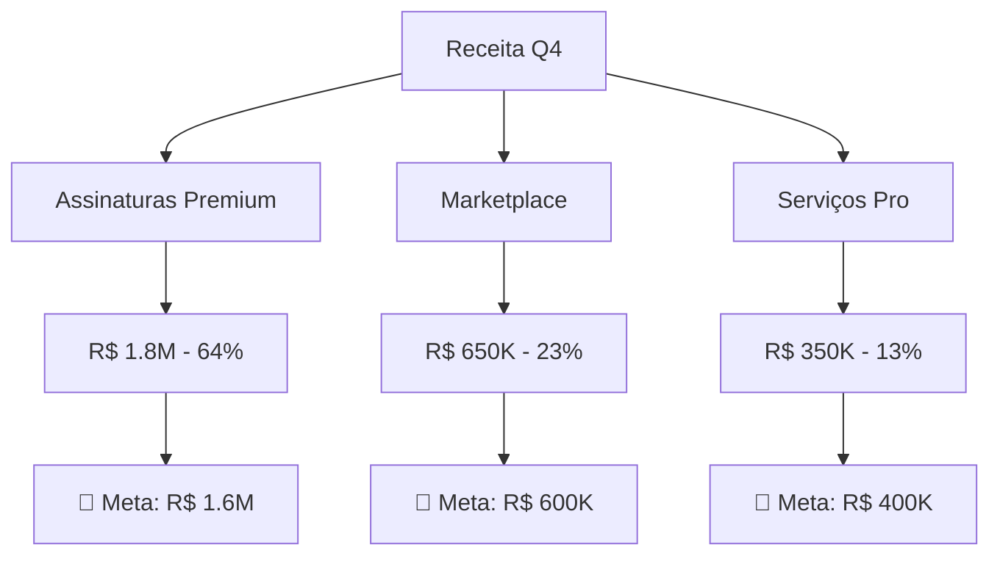
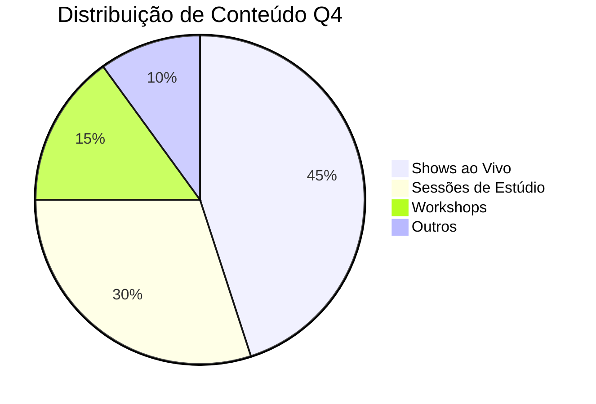
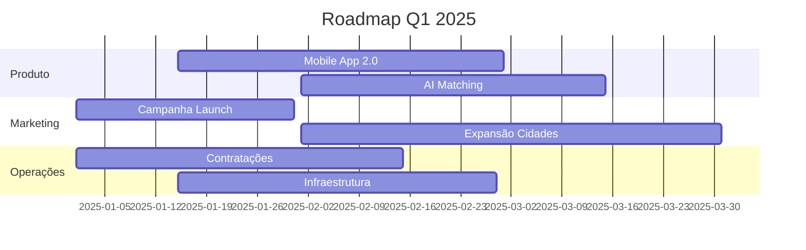

---
# Configurações do Documento
title: "Relatório de Performance Q4 2024"
subtitle: "Análise Trimestral de Resultados"
author: "Equipe SoundLink Analytics"
date: "2024-01-15"
version: "2.1"
description: "Relatório detalhado da performance da plataforma no último trimestre"
keywords: "performance, analytics, Q4, SoundLink"

# Configurações de Layout
template: "corporate"           # minimal, corporate, academic
format: "A4"                   # A4, A3, Letter, etc.
orientation: "portrait"        # portrait, landscape

# Configurações de Margens
margins:
  top: "25mm"
  right: "20mm"
  bottom: "25mm"
  left: "20mm"

# Configurações de Cabeçalho
header:
  enabled: true
  template: |
    

      

        <strong style="color: #3498db;">🚀 SoundLink</strong>
      

      

        <strong>{{document.title}}</strong> 
        <small style="color: #7f8c8d;">{{document.subtitle}}</small>
      

      

        {{date.formatted}} 
        v{{document.version}}
      

    

# Configurações de Rodapé
footer:
  enabled: true
  template: |
    

      

        <strong>{{document.author}}</strong> 
        <small>{{generator.name}}</small>
      

      

        <strong>CONFIDENCIAL</strong> 
        <small>Uso interno</small>
      

      

        <strong>Página {{page.current}} de {{page.total}}</strong> 
        <small>{{stats.words}} palavras</small>
      

    

# Configurações de Alinhamento
text_alignment:
  paragraphs: "justify"
  headers: "left"
  tables: "center"
  images: "center"

# Configurações de Numeração
page_numbers:
  enabled: true
  position: "footer-right"
  format: "{current}/{total}"
  start_from: 1

# Configurações de Quebra de Página
page_breaks:
  before_sections: ["h1"]
  avoid_inside: ["table", "pre"]

# Configurações de Segurança
security:
  watermark:
    enabled: true
    text: "SoundLink Confidencial"
    opacity: 0.05
---

# 📊 Relatório de Performance Q4 2024

## 🎯 Resumo Executivo

Este relatório apresenta uma análise detalhada da **performance da plataforma SoundLink** durante o quarto trimestre de 2024, incluindo métricas de usuários, receita e engajamento.

### 📈 Principais Resultados

| Métrica | Q3 2024 | Q4 2024 | Variação |
|---------|---------|---------|----------|
| Usuários Ativos | 125.420 | 156.890 | +25.1% 📈 |
| Receita Mensal | R$ 2.1M | R$ 2.8M | +33.3% 💰 |
| Taxa de Retenção | 78.5% | 82.3% | +3.8% ✅ |
| NPS Score | 67 | 73 | +6 pontos 🌟 |

## 🔍 Análise Detalhada

### 👥 Crescimento de Usuários

O crescimento de **25.1%** no número de usuários ativos mensais demonstra a força da nossa estratégia de aquisição:

- **Campanhas digitais**: +15.2% de conversão
- **Programa de indicação**: +8.9% de novos usuários
- **Parcerias estratégicas**: +12.4% de crescimento orgânico

### 💰 Performance Financeira

### 📱 Engagement por Plataforma

O engajamento dos usuários mostrou crescimento consistente em todas as plataformas:

#### Mobile 📱
- **Tempo médio de sessão**: 12.5 min (+2.1 min)
- **Frequência de uso**: 4.2x/semana (+0.8x)
- **Features mais usadas**: Discovery, Chat, Booking

#### Desktop 💻
- **Tempo médio de sessão**: 18.7 min (+1.4 min)
- **Frequência de uso**: 2.8x/semana (+0.3x)
- **Features mais usadas**: Studio Manager, Analytics, Calendar

### 🎵 Análise de Conteúdo

## 🚀 Projetos Especiais

### 🎤 Lançamento do SoundLink Studio Pro

Em dezembro, lançamos a **versão Pro** da nossa ferramenta de estúdio:

> 💡 **"O SoundLink Studio Pro revolucionou meu processo criativo. A qualidade de áudio e as ferramentas de colaboração são excepcionais."**
>
> — Marina Silva, Produtora Musical

### 📊 Métricas de Adoção

- **Beta users**: 2.847 músicos
- **Taxa de conversão**: 67.3%
- **NPS do produto**: 81 pontos
- **Tempo médio de primeira sessão**: 45 minutos

## 🎯 Metas para Q1 2025

### 📈 Objetivos Principais

1. **Crescimento de Usuários**
   - Meta: +20% de usuários ativos
   - Estratégia: Expansão para 3 novas cidades
   - Budget: R$ 1.2M em marketing

2. **Receita**
   - Meta: R$ 3.2M/mês (+14.3%)
   - Foco: Planos corporativos
   - Novos produtos: SoundLink Events

3. **Produto**
   - Lançamento: App mobile 2.0
   - Features: AI-powered matching
   - Timeline: Março 2025

### 🔄 Iniciativas de Melhoria

## 🔍 Análise de Mercado

### 🏆 Posicionamento Competitivo

| Critério | SoundLink | Concorrente A | Concorrente B |
|----------|-----------|---------------|---------------|
| **UI/UX** | ⭐⭐⭐⭐⭐ | ⭐⭐⭐ | ⭐⭐⭐⭐ |
| **Preço** | ⭐⭐⭐⭐ | ⭐⭐ | ⭐⭐⭐⭐⭐ |
| **Features** | ⭐⭐⭐⭐⭐ | ⭐⭐⭐⭐ | ⭐⭐⭐ |
| **Suporte** | ⭐⭐⭐⭐⭐ | ⭐⭐ | ⭐⭐⭐ |

### 📱 Tendências do Setor

1. **Crescimento do streaming**: +35% ao ano
2. **Demanda por colaboração remota**: +67%
3. **Investimento em AI musical**: +120%

## 📋 Conclusões

### ✅ Principais Conquistas

- **Superação de metas** em todas as métricas principais
- **Lançamento bem-sucedido** do SoundLink Studio Pro
- **Fortalecimento da marca** no mercado nacional
- **Crescimento sustentável** da base de usuários

### 🚨 Desafios Identificados

- **Concorrência crescente** no segmento premium
- **Necessidade de expansão** da equipe técnica
- **Pressão por inovação** constante de produto

### 🎯 Próximos Passos

1. **Execução do roadmap Q1 2025**
2. **Monitoramento de KPIs** semanais
3. **Ajustes estratégicos** conforme mercado
4. **Preparação para expansão** internacional

---

## 📞 Contatos

**Equipe de Analytics**
- 📧 analytics@soundlink.com.br
- 📱 (11) 99999-9999
- 🌐 dashboard.soundlink.com.br

**Para dúvidas sobre este relatório:**
- 👤 Marina Analytics (Lead)
- 👤 João Data Science (Analyst)
- 👤 Ana Business Intelligence (Specialist)

---

*Este documento contém informações confidenciais da SoundLink. Distribuição restrita à equipe executiva.* 