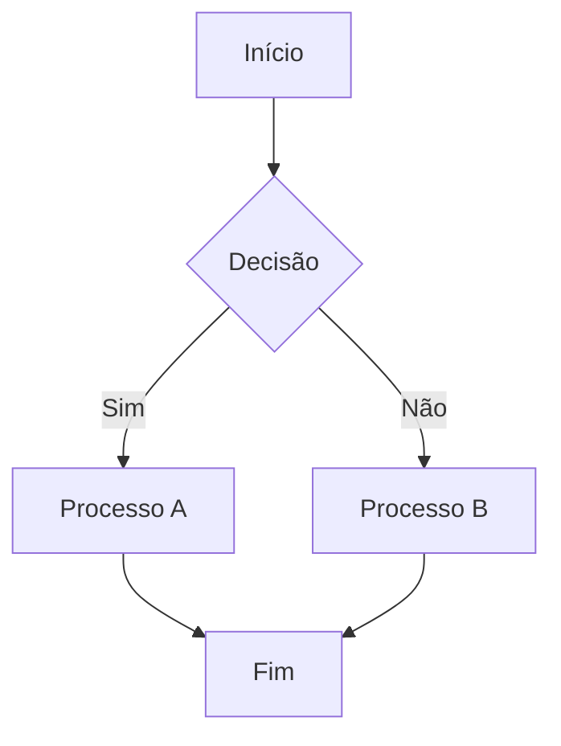
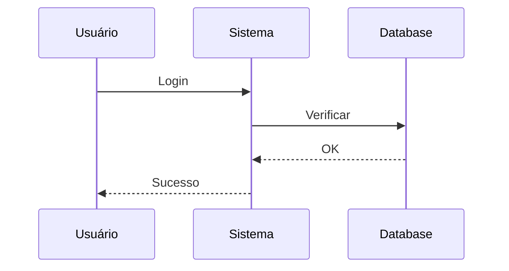
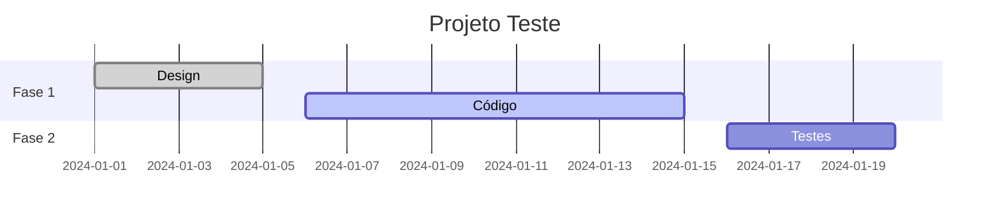
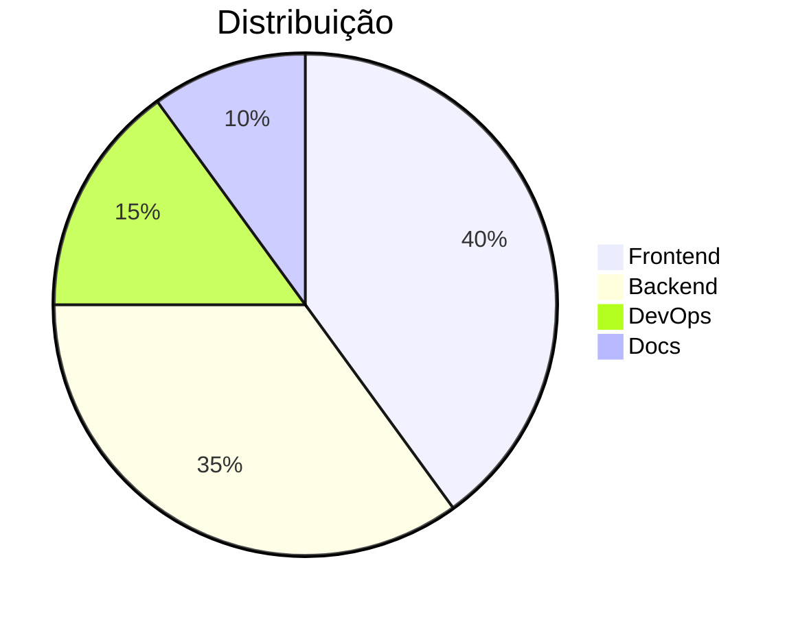
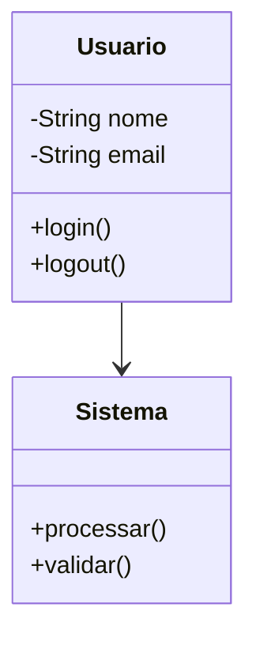

# 🎨 Teste de Funcionalidade Mermaid - Instruções Detalhadas

## 📋 Resumo das Correções Implementadas

### ✅ Melhorias no `MermaidProcessor`
1. **Template HTML aprimorado** com `DOMContentLoaded`
2. **Configuração de segurança** com `securityLevel: 'loose'`
3. **Retry automático** com `mermaid.run()` 
4. **Logging detalhado** para diagnóstico
5. **Timeout aumentado** e wait times melhorados
6. **Melhor handling de erros** e cleanup

### ✅ Melhorias no `HTMLGenerator`
1. **CSS aprimorado** para `.mermaid-diagram`
2. **Placeholders visuais** para diagramas
3. **Estilos de impressão** melhorados
4. **Page-break controls** para PDF

## 🧪 Como Testar

### 1. Verificar Dependências
```bash
# Verificar se Playwright está instalado
pip show playwright

# Instalar navegador se necessário
playwright install chromium
```

### 2. Testar com Arquivo Simples
Use o arquivo `teste-mermaid.md` que foi criado:

```bash
# Teste básico
python3 src/main.py teste-mermaid.md --verbose

# Gerar apenas HTML para debug
python3 src/main.py teste-mermaid.md --html --verbose
```

### 3. Verificar Logs
Os logs devem mostrar:
```
🎨 Processando diagramas Mermaid...
INFO:src.parser.mermaid_processor:Rendering diagram mermaid-0...
INFO:src.parser.mermaid_processor:SVG found for diagram mermaid-0
INFO:src.parser.mermaid_processor:Successfully rendered diagram mermaid-0
```

### 4. Analisar HTML Gerado
Se usar `--html`, verifique se o arquivo HTML contém:
- ✅ Elementos `<div class="mermaid-diagram">`
- ✅ SVGs renderizados `<svg>`
- ❌ Placeholders `mermaid-placeholder` (devem ser substituídos)

## 🔍 Diagnóstico de Problemas

### Problema 1: Playwright não funciona
**Sintomas:**
- Erro sobre navegador não encontrado
- Timeout ao renderizar diagramas

**Soluções:**
```bash
# Reinstalar Playwright
pip uninstall playwright
pip install playwright
playwright install chromium

# Verificar sistema
playwright --version
```

### Problema 2: Diagramas não aparecem no PDF
**Sintomas:**
- PDF gerado sem diagramas
- Placeholders vazios

**Diagnóstico:**
```bash
# Gerar HTML para análise
python3 src/main.py teste-mermaid.md --html --verbose

# Verificar se contém SVG
grep -i "svg" teste-mermaid.html
```

### Problema 3: Syntax Error no Mermaid
**Sintomas:**
- Erro de sintaxe nos diagramas
- Renderização falha

**Verificação:**
- Usar [Mermaid Live Editor](https://mermaid.live) para validar sintaxe
- Verificar indentação e caracteres especiais

## 📊 Arquivo de Teste Completo

Crie um arquivo `teste-completo-mermaid.md`:

```markdown
---
title: "Teste Completo Mermaid"
subtitle: "Todos os Tipos de Diagramas"
author: "Sistema de Teste"
description: "Teste abrangente de diagramas Mermaid"
---

# 🎨 Teste Completo de Diagramas Mermaid

## 📊 Fluxograma


## 🔄 Diagrama de Sequência


## 📈 Gráfico de Gantt


## 🥧 Gráfico de Pizza


## 📋 Diagrama de Classes


Teste concluído! 🎉
```

## 🚀 Comandos de Teste

```bash
# 1. Teste básico
python3 src/main.py teste-mermaid.md

# 2. Teste com logs detalhados
python3 src/main.py teste-mermaid.md --verbose

# 3. Teste apenas HTML
python3 src/main.py teste-mermaid.md --html

# 4. Teste com arquivo completo
python3 src/main.py teste-completo-mermaid.md --verbose

# 5. Teste com formato A3
python3 src/main.py teste-mermaid.md --format A3

# 6. Teste com orientação paisagem
python3 src/main.py teste-mermaid.md --landscape
```

## 🔧 Troubleshooting Avançado

### Verificar Processo Completo
```bash
# 1. Verificar extração de diagramas
python3 debug_mermaid.py

# 2. Verificar processo simulado
python3 processo_mermaid.py

# 3. Verificar dependências
pip list | grep -E "(playwright|mermaid|markdown)"
```

### Logs Detalhados
Para debug avançado, adicione no início do arquivo Python:
```python
import logging
logging.basicConfig(level=logging.DEBUG)
```

### Verificar Arquivos Temporários
Os arquivos HTML temporários são criados em `/tmp/` - você pode verificar se estão sendo gerados corretamente.

## ✅ Resultado Esperado

Após implementar todas as correções, você deve ver:

1. **Logs de sucesso:**
   ```
   🎨 Processando diagramas Mermaid...
   INFO: Successfully rendered diagram mermaid-0
   📄 Gerando PDF...
   ✅ PDF gerado com sucesso: teste-mermaid.pdf
   ```

2. **PDF com diagramas:**
   - Diagramas renderizados como SVG
   - Qualidade vetorial
   - Cores e formatação corretas

3. **HTML intermediário:**
   - Diagramas convertidos para SVG
   - Sem placeholders restantes
   - CSS aplicado corretamente

## 🎉 Próximos Passos

Se tudo funcionar corretamente:
1. ✅ Mermaid está funcionando
2. ✅ Diagramas aparecem no PDF
3. ✅ Qualidade vetorial mantida
4. ✅ Cores e estilos aplicados

Se ainda houver problemas:
1. 🔍 Verificar logs detalhados
2. 🧪 Testar com diagramas mais simples
3. 🔧 Verificar instalação do Playwright
4. 📧 Reportar erro com logs completos

---

## 🚨 Correções de Timeout Aplicadas

### **Problema "Carregando diagrama..."**
- **Causa**: Timeouts insuficientes para renderização
- **Sintoma**: PDF mostra "🎨 Carregando diagrama..." em vez dos diagramas

### **Correções Implementadas:**

1. **MermaidProcessor:**
   - Timeout: 30s → **60s**
   - Retry timeout: 10s → **30s**
   - Espera adicional: 1s → **3s**

2. **PDFGenerator:**
   - Timeout: 10s → **30s**
   - Espera adicional: 2s → **5s**
   - Seletor corrigido: `.mermaid svg` → **`.mermaid-diagram svg`**

3. **Template HTML:**
   - Propriedade `fontSe` corrigida para `fontSize`
   - Try/catch adicionado para melhor tratamento de erros

### **Teste das Correções:**
```bash
# Testar timeouts corrigidos
python3 docs/testes/teste_timeout_mermaid.py

# Testar com arquivo real
python3 markdown_pdf_generator.py docs/testes/teste-mermaid.md --verbose
```

---

**Implementado por**: Sistema de Correção Mermaid  
**Data**: 2024-01-15  
**Versão**: 1.1.0  
**Status**: ✅ Correções Aplicadas + Timeouts Corrigidos 