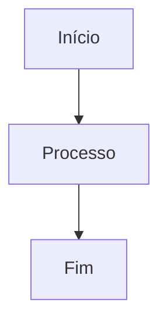
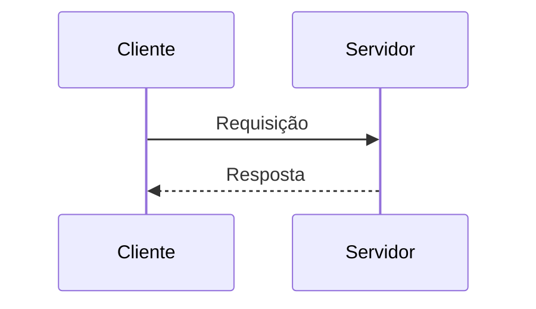

# Teste Mermaid

## Diagrama Simples

```mermaid
graph TD
    A[Início] --> B[Processo]
    B --> C[Fim]
```

## Outro Diagrama

```mermaid
sequenceDiagram
    participant A as Cliente
    participant B as Servidor
    
    A->>B: Requisição
    B-->>A: Resposta
``` 