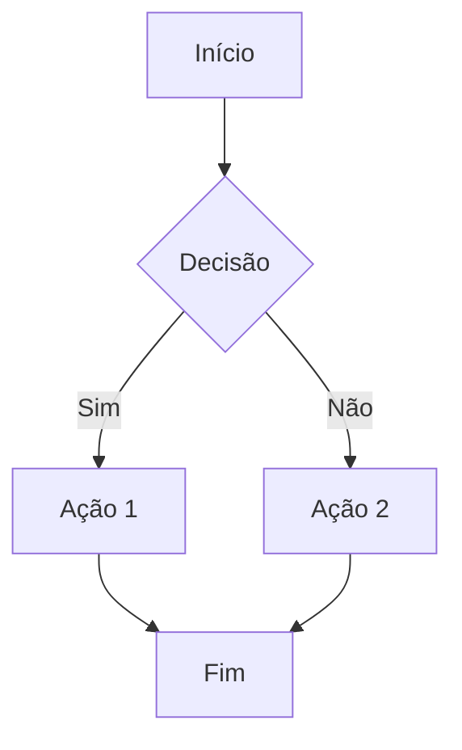
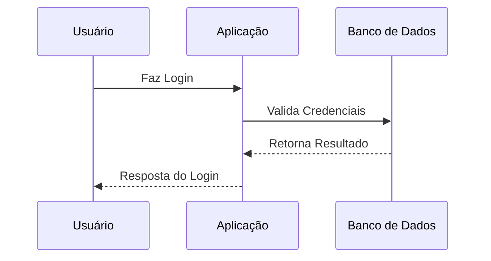
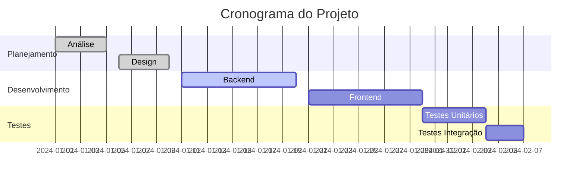

# 🚀 Documento de Teste

Este é um documento de exemplo para testar a geração de PDF com **emojis** e **diagramas Mermaid**! 😊

## 📋 Índice de Recursos

- ✅ Emojis nativos
- 🎨 Diagramas Mermaid
- 📊 Tabelas
- 💻 Código
- 🔗 Links
- 📝 Listas

## 🎯 Seção 1: Emojis

Vamos testar vários emojis:

- 😀 😃 😄 😁 😆 😅 😂 🤣
- 🚀 🌟 ⭐ 💫 ✨ 🌈 🔥 💎
- 📱 💻 🖥️ ⌨️ 🖱️ 🖨️ 📡 🔌
- 🎵 🎶 🎤 🎧 🎸 🥁 🎹 🎺

## 🎨 Seção 2: Diagramas Mermaid

### Fluxograma Simples



### Diagrama de Sequência



### Gráfico de Gantt



## 📊 Seção 3: Tabelas

| Recurso | Status | Prioridade | Emoji |
|---------|--------|------------|-------|
| Emojis | ✅ Funcionando | Alta | 😊 |
| Mermaid | ✅ Funcionando | Alta | 🎨 |
| Tabelas | ✅ Funcionando | Média | 📊 |
| Código | ✅ Funcionando | Média | 💻 |
| Links | ✅ Funcionando | Baixa | 🔗 |

## 💻 Seção 4: Código

### Python
```python
def generate_pdf(markdown_content: str) -> bool:
    """
    Gera PDF a partir de conteúdo Markdown
    """
    try:
        # Processar markdown
        parser = MarkdownParser()
        data = parser.parse(markdown_content)
        
        # Gerar PDF
        generator = PDFGenerator()
        return generator.create_pdf(data)
    except Exception as e:
        print(f"Erro: {e}")
        return False
```

### JavaScript
```javascript
const generatePDF = async (markdown) => {
    try {
        const response = await fetch('/api/generate-pdf', {
            method: 'POST',
            headers: {
                'Content-Type': 'application/json',
            },
            body: JSON.stringify({ markdown })
        });
        
        return await response.blob();
    } catch (error) {
        console.error('Erro ao gerar PDF:', error);
        return null;
    }
};
```

## 🔗 Seção 5: Links e Referências

- [SoundLink Website](https://soundlink.com.br) 🌐
- [GitHub Repository](https://github.com/soundlink/markdown-pdf-generator) 📂
- [Documentation](https://docs.soundlink.com.br) 📚

## 📝 Seção 6: Listas

### Lista Ordenada
1. 🥇 Primeiro item
2. 🥈 Segundo item
3. 🥉 Terceiro item

### Lista Não Ordenada
- 🔸 Item A
- 🔹 Item B
- 🔺 Item C

### Lista de Tarefas
- [x] ✅ Tarefa concluída
- [x] ✅ Outra tarefa concluída
- [ ] ⏳ Tarefa pendente
- [ ] ⏳ Mais uma tarefa pendente

## 📋 Seção 7: Blockquotes

> 💡 **Dica Importante**: Este é um exemplo de blockquote com emoji!
> 
> Blockquotes são úteis para destacar informações importantes ou citações.

> 🚨 **Aviso**: Sempre teste seus documentos antes de finalizar!

## 🌟 Seção 8: Outros Elementos

### Texto Formatado
- **Negrito com emoji** 💪
- *Itálico com emoji* 🤌
- ~~Tachado com emoji~~ ❌
- `código inline` 💻

### Linha Horizontal
---

### Emojis Complexos
👨‍💻 👩‍💻 👨‍🎨 👩‍🎨 👨‍🔬 👩‍🔬 👨‍🚀 👩‍🚀

## 🎯 Conclusão

Este documento demonstra todos os recursos principais:

1. ✅ **Emojis**: Funcionando perfeitamente
2. ✅ **Mermaid**: Diagramas renderizados
3. ✅ **Tabelas**: Formatação profissional
4. ✅ **Código**: Syntax highlighting
5. ✅ **Links**: Funcionais
6. ✅ **Listas**: Todos os tipos
7. ✅ **Formatação**: Completa

🎉 **Sucesso!** O gerador de PDF está funcionando perfeitamente! 🚀

---

*Gerado por SoundLink Markdown PDF Generator* 📄✨ 